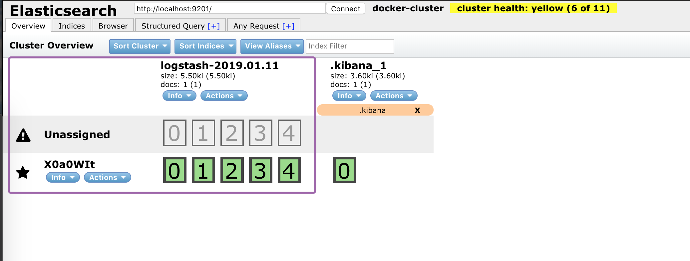
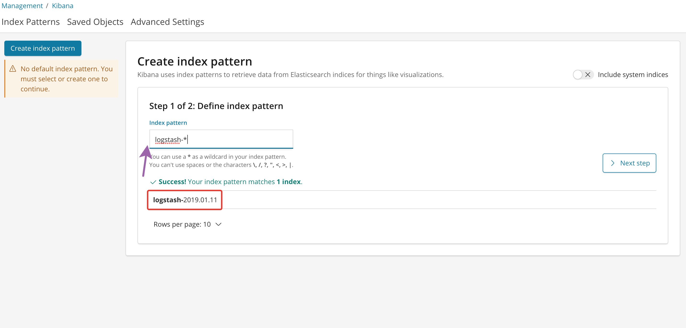
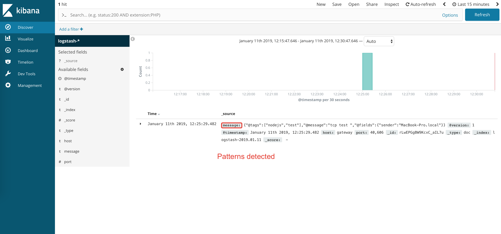
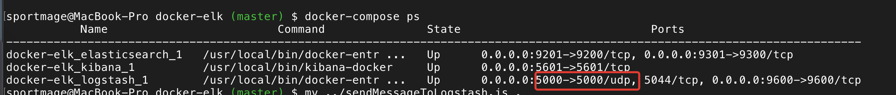

In this tutorial we try send to `Logstash` instance a test data via `UDP` protocol. I'm new to this `ELK` (Elastic Logstash Kibana) stack and many new questions for me. The best varinat try in practice.

In next we we will use the predefined [ELK](https://github.com/deviantony/docker-elk) images based on `Docker`.

```shell
git clone git@github.com:deviantony/docker-elk.git
cd docker-elk && docker-compose up --build -d
```

After up all `ELK` containers need check `Logstash` status. Easy way:

```shell
echo "Hello Logstash" | nc localhost 5000
```

In another way will use nodejs script `send-tcp.js`. You can edit the `Logstash` values for `host` and `port` as you need.

```js
/* globals require:true, console:true, process:true */

// This script will send a message to a [logstash](http://logstash.net/)
// server using the [TCP input](http://logstash.net/docs/1.1.13/inputs/tcp)
// and then quit. If there is no listener, it will just quit.

'use strict';

var net = require('net');

var logHost = '127.0.0.1'
  , logPort = 5000
  , sender = require('os').hostname();

var conn = net.createConnection({ host: logHost, port: logPort }, function() {
  var message = {
    '@tags': ['nodejs', 'test']
  , '@message': 'tcp test '
  , '@fields': {'sender': sender}
  }
  conn.write(JSON.stringify(message));
  process.exit(0);
})
.on('error', function(err) {
  console.error(err);
  process.exit(1);
});
```

Execution this script:

```shell
node send-tcp.js
```

Now we can check Elastic indexies and see new `Logstash` index. For this porpose is cool extension [Elastic Head](https://github.com/mobz/elasticsearch-head) for Google Chrome.



Go to `Kibana` in browser with standard port `http://localhost:5601` and see detected the `Logstash` index:



After configure `Logstash` index we can use the `Discover` tab for visualize search:




## Setup UDP transport

For more info https://www.elastic.co/guide/en/logstash/current/plugins-inputs-udp.html

First step we install the `UDP Plugin` for `Logstash` container - to `logstash/Dockerfile`:

```shell
# Added UDP Plugin
RUN logstash-plugin install logstash-input-udp
```

Setup the UDP `input` in `logstash/pipeline/logstash.conf`:

```json
input {
	udp {
		port => 5000
	}
}
```

And setup the UDP `port` in `docker-compose.yml`:

```yml
logstash:
    ...
    ports:
      - "5000:5000/udp"
```

Then need rebuild `docker` containers:

```shell
docker-compose up --build -d
```



For check `UDP` transport we use `send-udp.js` script:

```js
/* globals require:true, console:true, process:true */

// This script will send a message to a [logstash](http://logstash.net/)
// server using the [TCP input](http://logstash.net/docs/1.1.13/inputs/tcp)
// and then quit. If there is no listener, it will just quit.

'use strict';

var udp = require('dgram');

var buffer = require('buffer');

// creating a client socket
var client = udp.createSocket('udp4');

//buffer msg
var data = Buffer.from('udpmessage');

//sending msg
client.send(data, 5000,'localhost',function(error) {
  if (error) {
    client.close();
  } else {
    console.log('Data sent !!!');
    client.close();
  }
});
```
