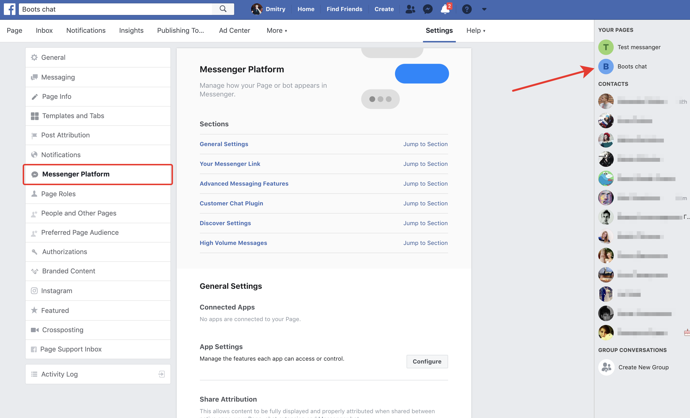
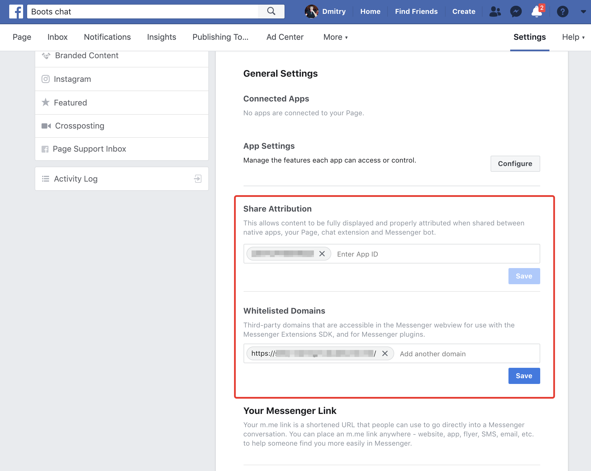

For connect Facebook Messenger with page you need:
- select your facebook `page` (pre-created before)
- click to settings
- in left menu click to `Messenger Platform` item

- Enter your `App ID` to `Share Attribution` field and save
- Enter your site domain to `Whitelisted Domains` field and save
