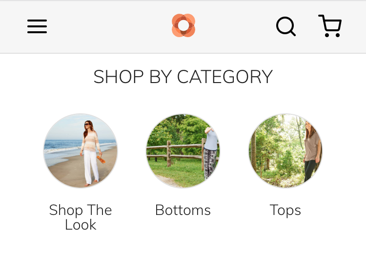

```shell
git clone https://github.com/magento-research/pwa-studio.git
cd pwa-studio
npm install
cp packages/venia-concept/.env.dist packages/venia-concept/.env
```

In the .env file set the value of `MAGENTO_BACKEND_URL` to the `URL` of a running Magento instance. For my case is the `http://m230.test/`.

Then execute:

```shell
npm run build
```

See some validation errors:

```shell
Cannot validate queries because the configured Magento backend http://m230.test/ disallows introspection in "production" mode. If you can do so, set this Magento instance to "developer" mode.

The introspection query to http://m230.test/graphql failed with the following errors:
	- GraphQL introspection is not allowed, but the query contained __schema or __type
	- Max query depth should be 10 but got 11.

The current default backend for Venia development is:

	https://release-dev-rxvv2iq-zddsyhrdimyra.us-4.magentosite.cloud/

The configured MAGENTO_BACKEND_URL in the current environment is

	http://m230.test/

Consider updating your .env file or environment variables to resolve the reported issues.
```

Setup the `developer mode` for your magento instance:

```shell
bin/magento deploy:mode:set developer
```

After setup the `developer` mode we try to again execute build:

```shell
npm run build
```

See another errors:

```shell
/Users/sportmage/workspace/pwa-studio/packages/venia-concept/src/queries/getProductDetail.graphql
  37:25  error  Cannot query field "fashion_color" on type "SimpleProduct"  graphql/template-strings

/Users/sportmage/workspace/pwa-studio/packages/venia-concept/src/RootComponents/Product/Product.js
  48:29  error  Cannot query field "fashion_color" on type "SimpleProduct"  graphql/template-strings

✖ 2 problems (2 errors, 0 warnings)


  These errors may indicate:
  -  an out-of-date Magento 2.3 codebase running at "http://m230.test/"
  -  an out-of-date project codebase whose queries need updating

Use GraphiQL or another schema exploration tool on the Magento store to learn more.
```

This happens because you're running against a Magento instance that has no Venia sample data and because the Venia GraphQL queries for product options `fashion_color` and `fashion_size` are hardcoded.
Related [issue](https://github.com/magento-research/pwa-studio/issues/626)

For fixed need to install the `Venia sample data`:

```shell
chmod +x pwa-studio/packages/venia-concept/deployVeniaSampleData.sh
```

Then execute the `setup:upgrade` for your magento instance:

```shell
bin/magento setup:upgrade
```

Upd:
And i am have [issue](https://github.com/magento-research/pwa-studio/issues/561) with setup on stage with `Docker`:

For fix need install additionally `envalid` package before `npm run build`:

```shell
npm install envalid
```