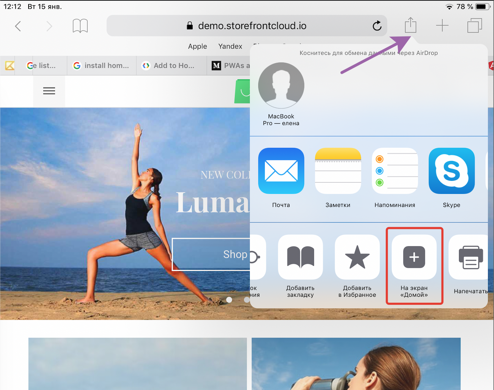
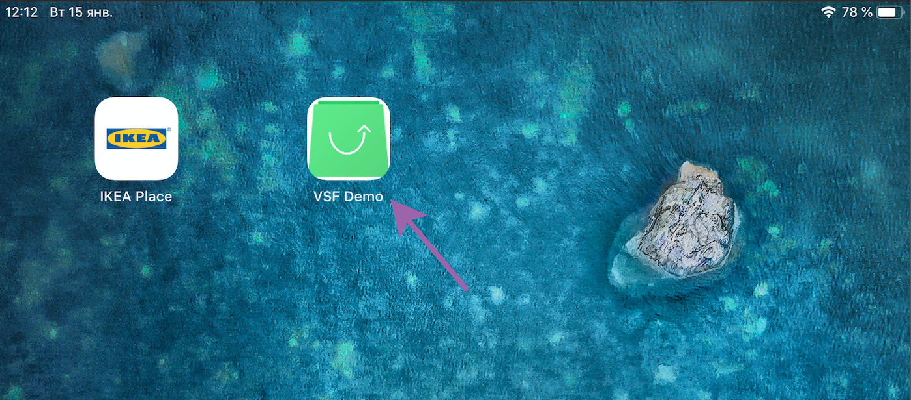

Today spent a lot of time to add the `PWA` icon to the home screen on iPad (tested on iOS 12.1.1). For my application, for some reason, the standard `PWA` [prompt](https://developers.google.com/web/fundamentals/app-install-banners/) was not showed, and i am find how to do it manually:

And we see the icon on home screen:

