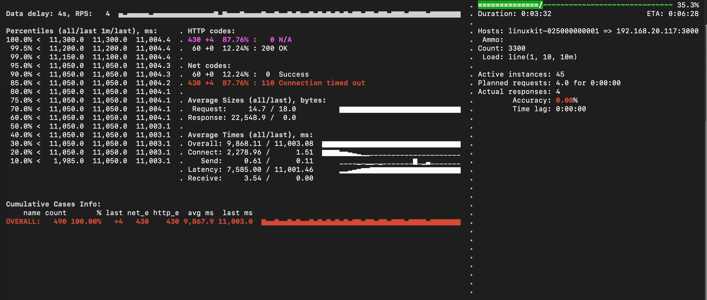
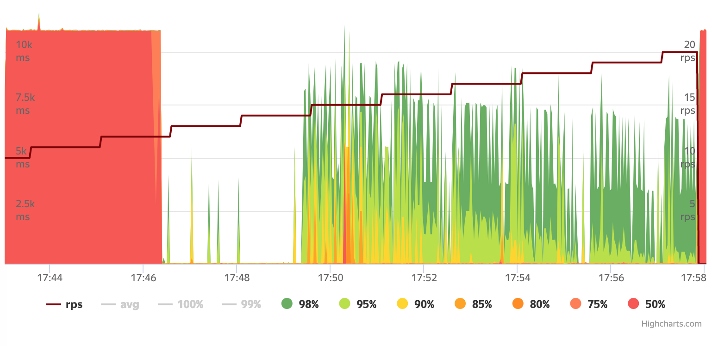
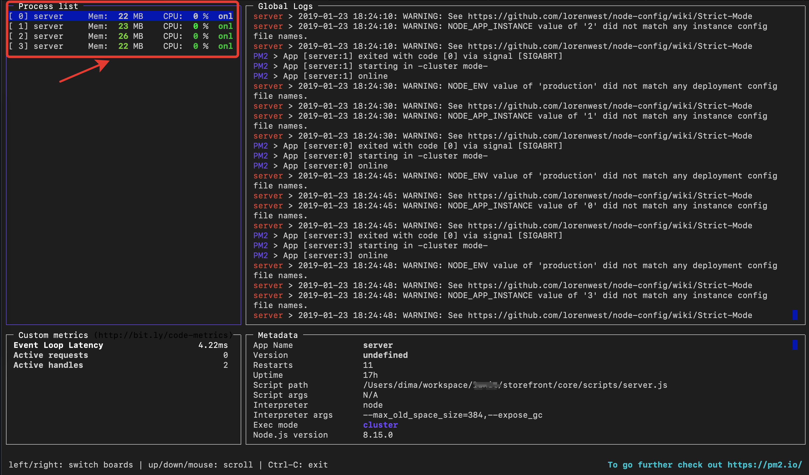
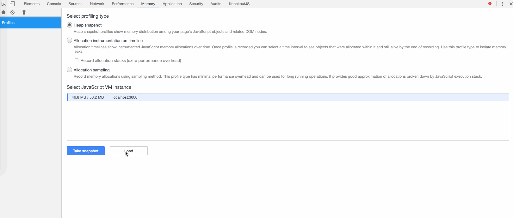

Sometimes is required to identify the limitations of performance and bottlenecks of an application in order to make the most efficient use of its resources. Detect a `memory leaks` for you apps may be critical for production environments. Let's look at how to identify such moments using `Yandex Tank` benchmark.

## Setup Yandex Tank

In first we create directory and config file:

```shell
mkdir ~/loadtest && touch load.yaml
```

Add next configuration to `load.yaml`:

```shell
phantom:
  address: 192.168.20.117:3000 # [Target's address]:[target's port]
  uris:
    - /
  load_profile:
    load_type: rps # schedule load by defining requests per second
    schedule: line(1, 10, 10m) # starting from 1rps growing linearly to 10rps during 10 minutes
console:
  enabled: true # enable console output
telegraf:
  enabled: false # let's disable telegraf monitoring for the first time
```

Important sections `address`, `uris` and `schedule`. For `address` key need setup `host` and `port` for you tested application.

Then we can start `Yandex Tank` with using prepared Docker image (if you use macosx - need install `Docker for Mac`)

```shell
docker run -v $(pwd):/var/loadtest -v $SSH_AUTH_SOCK:/ssh-agent -e SSH_AUTH_SOCK=/ssh-agent -v $HOME/.ssh:/root/.ssh --net host -it direvius/yandex-tank
```

And see output:



You can create alias for simplify using (for macosx):

```shell
echo "alias tank=\"docker run -v $(pwd):/var/loadtest -v $SSH_AUTH_SOCK:/ssh-agent -e SSH_AUTH_SOCK=/ssh-agent -v $HOME/.ssh:/root/.ssh --net host -it direvius/yandex-tank\"" >> ~/.bash_profile && source ~/.bash_profile
```

And using one:

```shell
tank
```


## Visualizing Data

For visualize load metrics out of the box we can setup the [Overload Beta](https://overload.yandex.net/mainpage/guide#install) service:

Example view of `Quantiles`:



Drawdowns towards the end of the test indicate a restart of the PODs, respectively, memory leaks or high consumption, followed by GC (Garbage Collector) cleaning.

## Detecting memory leaks for nodejs apps

[pm2](https://github.com/Unitech/pm2) is best Process Manager with a built-in Load Balancer. We can use `pm2` for monitoring memory using you `nodejs` apps.

Usable tips:

```shell
node_modules/pm2/bin/pm2 monit
node_modules/pm2/bin/pm2 imonit
```

`Process List` is important section:



### Heapdumps analisis

By `Comparison` option via Chrome Dev Tools you can detect memory delta between heapdumps


